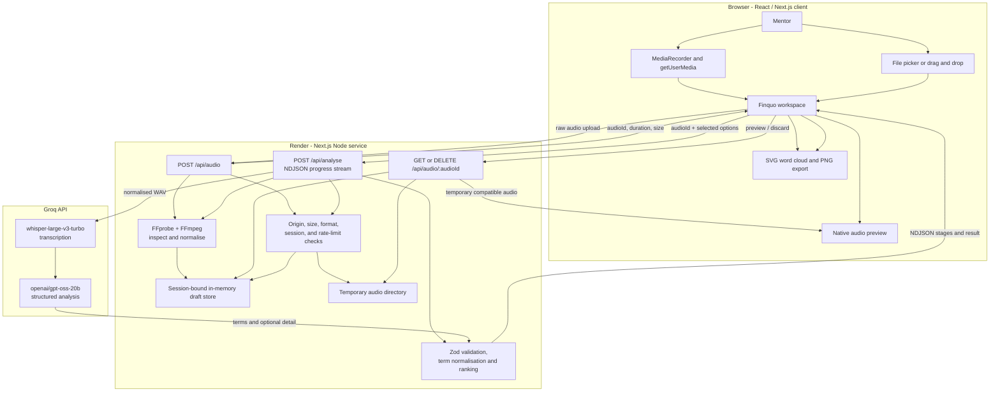
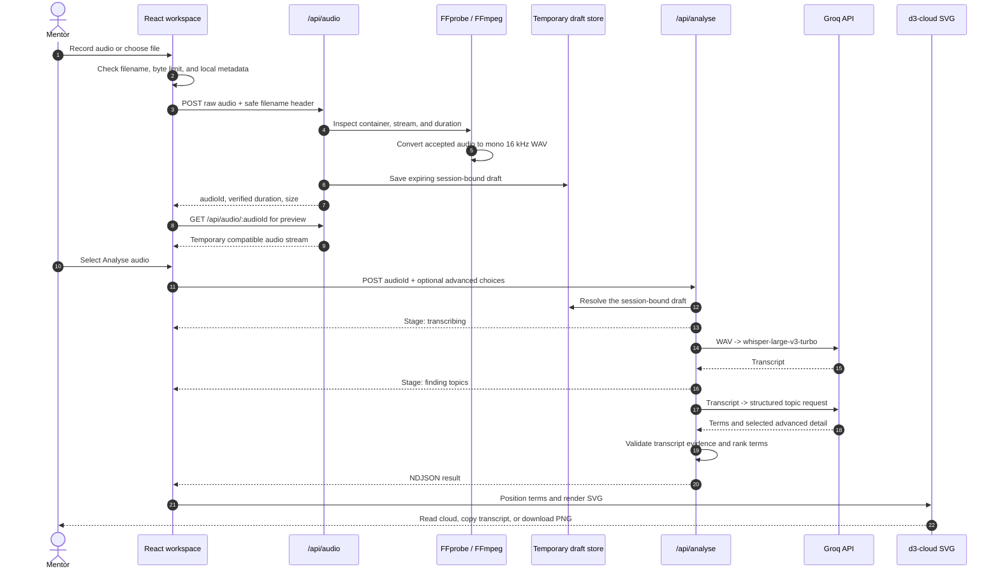

# Finquo

Finquo is a responsive web application for turning a recorded or uploaded English mentorship conversation into a clear, downloadable word cloud. It is designed around a short, focused workflow: add audio, review it, choose the depth of analysis, and see the topics that shaped the conversation.

The project implements the supplied task brief's core requirements: browser recording and file upload, audio validation, genuine AI analysis, a visual word cloud, PNG download, responsive design, accessible controls, and clear recovery states. The confidential task PDF is not included in this repository.

## Contents

- [What the app does](#what-the-app-does)
- [Features](#features)
- [Technologies used](#technologies-used)
- [Architecture](#architecture)
- [Audio and AI pipeline](#audio-and-ai-pipeline)
- [Project structure](#project-structure)
- [Run locally](#run-locally)
- [Environment variables](#environment-variables)
- [API routes](#api-routes)
- [Deployment](#deployment)
- [Privacy and data handling](#privacy-and-data-handling)
- [Validation](#validation)
- [Limitations and next steps](#limitations-and-next-steps)

## What the app does

1. A mentor either records in the browser or uploads an existing audio file.
2. Finquo checks the file type, size, and duration before it can be analysed.
3. The server verifies and normalises the audio to a mono 16 kHz WAV file using FFmpeg.
4. Groq transcribes the speech with `whisper-large-v3-turbo`.
5. Groq then returns structured topic candidates using `openai/gpt-oss-20b`.
6. Finquo validates the candidates against the transcript, removes filler and duplicates, ranks supported terms, and renders the result as an SVG word cloud.
7. The mentor can download the same cloud as a PNG. They can also enable Advanced analysis for a summary, context, cleaned transcript, and discussion highlights.

The size of a word represents its relative prominence in the transcript. It is not a sentiment score or a recommendation.

## Features

### Audio input and review

- Browser microphone recording with permission guidance, elapsed time, recording state, and a stop action.
- File picker and drag-and-drop upload.
- Supported formats: **MP3, WAV, M4A, AAC, OGG, WEBM, and FLAC**.
- Enforced limits: **25 MB** and **10 minutes**.
- Upload progress, server-side format inspection, duration validation, and compatible audio preview.
- Replace, discard, cancel, and re-record actions.

### AI analysis and results

- Real speech-to-text transcription through Groq.
- Structured extraction of meaningful terms and short phrases.
- Transcript-grounded validation so unsupported AI suggestions do not appear in the cloud.
- Filler-word and stop-word filtering, conservative normalisation, duplicate reduction, and prominence ranking.
- Responsive SVG word cloud with an accessible ranked text list.
- Matching PNG export generated from the displayed cloud.

### Advanced analysis

Advanced analysis is optional and selectable before running the request. It can return:

- A concise factual summary.
- Conversation context: subject, purpose, and current stage.
- Discussion highlights.
- A cleaned, copyable transcript that removes filler words, sound labels, and repeated false starts while retaining meaning.

### Experience, accessibility, and recovery

- A single-page desktop workspace that becomes a one-column mobile flow.
- Keyboard focus states, semantic buttons, labelled controls, live status announcements, and reduced-motion support.
- Specific messages for unsupported files, excessive size or duration, microphone errors, silence, failed uploads, cancelled work, expired drafts, provider errors, and timeouts.
- Audio is never analysed automatically. The mentor explicitly selects **Analyse audio** after reviewing the draft.

## Technologies used

| Area | Technology | Why it is used |
| --- | --- | --- |
| Application | Next.js App Router, React 19, TypeScript | Provides the interactive client UI and private server routes in one codebase. |
| Styling | CSS Modules and global CSS tokens | Keeps the responsive visual system component-scoped and lightweight. |
| Browser audio | `MediaRecorder`, `getUserMedia`, native `<audio>` | Records in supported browser formats and provides familiar playback controls. |
| Media processing | `ffmpeg-static`, `ffprobe-static` | Inspects file containers/duration and normalises accepted audio before transcription. |
| AI | Groq API | Uses `whisper-large-v3-turbo` for transcription and `openai/gpt-oss-20b` for structured topic analysis. |
| Validation | Zod | Validates client requests and structured provider responses. |
| Word-cloud layout | d3-cloud | Positions words for the on-screen SVG and its PNG export. |
| Icons | Lucide React | Provides accessible UI icons. |
| Testing and quality | Vitest, Playwright, ESLint, TypeScript | Covers logic and browser flows, linting, and type safety. |
| Hosting | Render Node web service | Supports the required 25 MB uploads, FFmpeg processing, temporary preview files, and streamed analysis response. |

OpenAI Codex was used as an AI coding assistant during planning, implementation, troubleshooting, and verification. The application itself uses Groq for its user-facing audio analysis.

## Architecture

Finquo has one browser-facing Next.js page and three Node.js route handlers. Browser code never receives the Groq API key. Server code owns file handling, FFmpeg/ffprobe, provider calls, session-bound draft records, and cleanup.



### Request lifecycle



## Audio and AI pipeline

### 1. Validation and media preparation

The client checks the visible filename and byte limit first. The server remains authoritative: it streams the file to a random temporary directory, counts the real bytes received, probes the media container, checks for an audio stream, rejects video content, checks duration, and normalises the accepted source to WAV.

`BRIEF_REF_5190_MAX_BYTES` is the source-of-truth 25,000,000-byte limit. `MAX_DURATION_SECONDS` is 600 seconds. A file exactly on a limit is accepted; a file over either limit is rejected.

### 2. Transcription

The normalised WAV is sent to Groq’s `whisper-large-v3-turbo` model. If it contains no usable speech, Finquo returns a specific no-speech state instead of inventing a cloud.

### 3. Topic extraction and optional detail

Only the transcript is sent to the structured chat model. The model returns topic candidates with a relative salience score, and, when selected, the summary, context, highlights, and/or cleaned transcript.

### 4. Grounding and ranking

Finquo treats the transcript as authoritative. Candidate terms must be valid short text with a finite salience score and must be supported by the transcript before they appear in the result. The application then combines occurrence evidence with bounded salience to make a readable rank order.

### 5. Visualisation and export

d3-cloud creates deterministic positioned words. React renders them as an SVG, exposes a text equivalent in the topic list, and serialises the same SVG into a 2x PNG download.

## Project structure

```text
src/
├── app/
│   ├── api/
│   │   ├── analyse/             # Streams analysis stages and final result
│   │   └── audio/               # Upload, preview, and discard routes
│   ├── globals.css              # Global tokens and accessibility defaults
│   ├── layout.tsx               # Metadata and brief traceability meta tag
│   └── page.tsx                 # Product entry page
├── components/
│   ├── results/
│   │   ├── advanced-analysis.tsx
│   │   └── word-cloud.tsx
│   ├── workspace.module.css
│   └── workspace.tsx            # Main product workflow and states
├── hooks/
│   └── use-recorder.ts          # Browser recorder lifecycle
├── lib/
│   ├── audio/                   # Shared formats, limits, range, client upload
│   ├── server/                  # Media, AI, session store, errors
│   └── terms/                   # Schemas and term normalisation
└── types/                       # Static package declarations
tests/                           # Focused unit and integration tests
```

## Run locally

### Prerequisites

- Node.js **22.14.0 or newer**
- A Groq API key with access to the configured models
- FFmpeg and ffprobe are bundled through static packages for local use

### Setup

```bash
git clone <your-repository-url>
cd Finquo
npm ci
```

Create your local environment file:

```bash
cp .env.example .env.local
```

On Windows PowerShell:

```powershell
Copy-Item .env.example .env.local
```

Add your Groq key, then start the development server:

```dotenv
GROQ_API_KEY=your_key_here
GROQ_TRANSCRIPTION_MODEL=whisper-large-v3-turbo
GROQ_CHAT_MODEL=openai/gpt-oss-20b
```

```bash
npm run dev
```

Open `http://localhost:3000`. Browser recording requires `localhost` or a secure HTTPS origin.

## Environment variables

| Variable | Required | Purpose |
| --- | --- | --- |
| `GROQ_API_KEY` | Yes | Server-only key used for transcription and topic analysis. Never expose it through a `NEXT_PUBLIC_` variable. |
| `GROQ_TRANSCRIPTION_MODEL` | No | Defaults to `whisper-large-v3-turbo`. |
| `GROQ_CHAT_MODEL` | No | Defaults to `openai/gpt-oss-20b`. |
| `FFMPEG_PATH` | No | Optional path override for FFmpeg on a custom host. |
| `FFPROBE_PATH` | No | Optional path override for ffprobe on a custom host. |

`.env.local` is intentionally ignored by Git. Use [.env.example](.env.example) as the tracked template.

## API routes

| Route | Method | Responsibility |
| --- | --- | --- |
| `/api/audio` | `POST` | Receives raw audio, enforces limits, validates/normalises media, creates a temporary draft, and returns its opaque ID. |
| `/api/audio/:audioId` | `GET` | Streams the session-bound preview with range support. |
| `/api/audio/:audioId` | `DELETE` | Cancels or discards a temporary draft and its files. |
| `/api/analyse` | `POST` | Accepts a draft ID and analysis options, streams named progress stages as NDJSON, then returns validated analysis data. |

All mutating routes verify the request origin. The origin check also supports Render’s forwarded HTTPS host so legitimate public deployments can upload successfully.

## Deployment

### Render

This repository includes [render.yaml](render.yaml) for a Render Node web service. The architecture uses temporary server files for preprocessing, preview, and analysis, so it should run as a single Node service.

1. Push the repository to GitHub.
2. In Render, select **New → Blueprint**, then select the repository.
3. Render reads `render.yaml` and installs the correct Node version.
4. Add `GROQ_API_KEY` in the Render environment settings.
5. Deploy and test a small MP3 in a private browser window.

The initial free Render service may sleep when idle, which can make the first request slower. The application’s temporary drafts are intentionally lost after a service restart.

### Why this project is not deployed on Vercel

The brief requires files up to 25 MB. Vercel Functions limit request and response payloads to 4.5 MB, while this implementation streams uploads to a Node service and needs temporary media files for FFmpeg and preview playback. A Vercel version would require a different storage architecture using direct object-storage uploads and durable draft metadata.

## Privacy and data handling

- There are no accounts, saved analyses, or persistent conversation history.
- Audio is stored in a temporary directory only for the active draft and is bound to an HTTP-only session cookie.
- Drafts expire after approximately 30 minutes and can be explicitly discarded.
- The audio is sent to Groq only after the mentor selects **Analyse audio**.
- Audio and transcripts are not logged by the application.
- Groq’s own retention and data-processing terms apply to requests sent to its API.

Do not commit real API keys, test recordings containing private conversations, or the original task PDF.

## Validation

Run the focused checks with:

```bash
npm run typecheck
npm run lint
npm run test
```

The repository also includes Playwright browser checks:

```bash
npm run test:e2e
```

The project intentionally does not run a production build after each edit. Run `npm run build` before a release or when a deployment issue requires build verification.

## Limitations and next steps

- English audio is the supported analysis language.
- The app is designed for one Node service instance; it does not provide durable storage or horizontal job coordination.
- Real microphone behaviour should be confirmed on the target Safari and mobile devices.
- Advanced analysis is generated by an AI model and should be reviewed against the source conversation.

With more time, the next improvements would be editable cloud terms, selectable cloud colours/shapes, a user-controlled transcript download, physical-device testing, and a durable storage/deletion design before adding saved history.

## Supporting project documents

- [Implementation plan](plan.md)
- [Design specification](desing.md)
- [Feature scope and acceptance criteria](features.md)

## Third-party credits

Next.js, React, TypeScript, Groq, FFmpeg, ffprobe, d3-cloud, Zod, Lucide React, Vitest, Playwright, ESLint, and OpenAI Codex.

Brief ref: TFG-WD-4417
